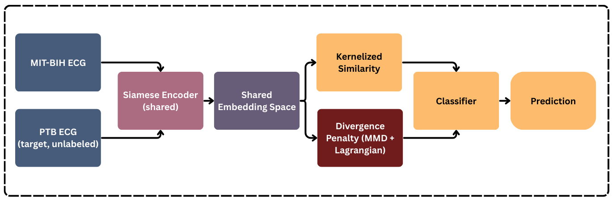

# Kernelized_Similarity_and_Lagrangian_Divergence

Electrocardiogram (ECG) classification is a critical application of machine learning in healthcare, yet models trained on a single dataset often fail to generalize when deployed in new clinical environments due to distribution shift. This work addresses the problem of single-domain generalization for ECG heartbeat classification, where a model trained on the MIT-BIH Arrhythmia Database must transfer directly to the PTB Diagnostic Database without access to target-domain labels. We propose a unified framework that combines Siamese representation learning, kernelized similarity, and an explicit divergence-penalty regularization based on Maximum Mean Discrepancy (MMD) with Lagrangian relaxation. The kernelized similarity module enables richer modeling of non-linear temporal structures in ECG signals compared to Euclidean distance, while the divergence penalty explicitly reduces source–target discrepancies in the learned embedding space. Extensive experiments demonstrate that the proposed method achieves state-of-the-art–level performance in-domain and yields consistent improvements under severe cross-dataset shift, including a 25\% relative gain in zero-shot binary classification accuracy on the unseen PTB dataset. Ablation studies further confirm the importance of non-linear distance geometry and explicit domain alignment in improving robustness. The results highlight the effectiveness of integrating similarity learning and distribution alignment for cross-dataset ECG analysis and provide insights into designing more reliable biomedical time-series models under realistic deployment conditions.
